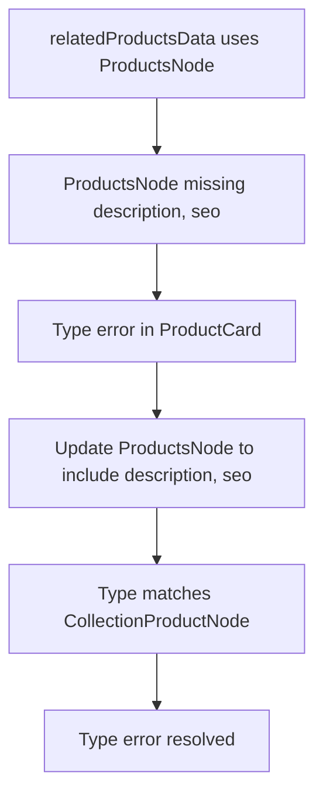

## 2025-04-12: Plan to Resolve Type Error in ProductCard Usage

### Problem
A type error occurs in `ClientProductPage.tsx` when passing `edge.node` (of type `ProductsNode`) to `ProductCard`, which expects a `CollectionProductNode`. The error is due to `ProductsNode` missing the `description` and `seo` fields, which are present in `CollectionProductNode`.

### Investigation Steps
- Compared `ProductsNode` and `CollectionProductNode` interfaces.
- Confirmed `ProductCard` expects a `CollectionProductNode`.
- Verified the GraphQL fragment (`BasicProductFragment`) used for related products includes `description` and `seo`.
- Determined the TypeScript type for `relatedProductsData` is `ProductsData`, which uses `ProductsNode` (missing the required fields).

### Solution Plan
1. **Type Alignment:**  
   Update `ProductsNode` in `lib/types/products.ts` to include:
   - `description: string`
   - `seo: SEO` (from `lib/types/type.ts`)

2. **Type Consistency:**  
   Ensure this change does not break other usages of `ProductsNode` (safe, as the fragment always returns these fields).

3. **Build Verification:**  
   Re-run the build to confirm the error is resolved.

#### Mermaid Diagram

### Next Step
Switch to Code mode and implement the type update in `lib/types/products.ts`.
