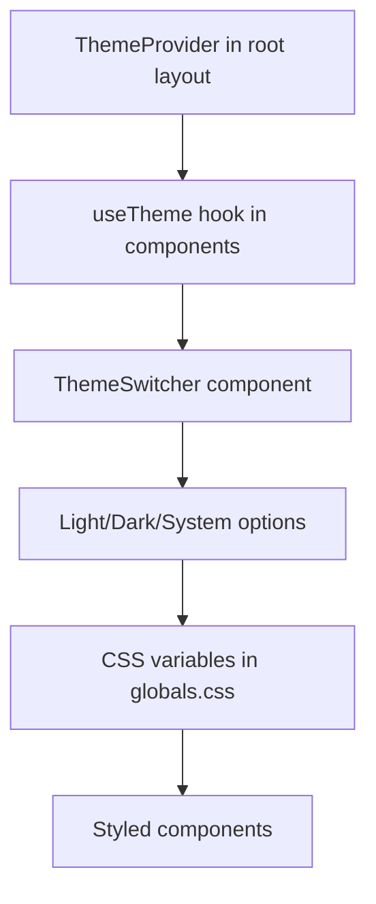

## 2025-04-12: Theme Toggle Implementation

### Current Focus
Implementing a theme toggle feature in both desktop and mobile headers to allow users to switch between light and dark themes.

### Implementation Details
- Using `next-themes` library for theme management
- Theme toggle component (`ThemeSwitcher`) implemented in `components/ui/theme-switcher.tsx`
- Integrated in both desktop and mobile headers
- Supports three modes: light, dark, and system
- Uses Lucide icons (Sun, Moon, Laptop) for visual representation
- Includes animation effects with Framer Motion

### Key Components
- `ThemeProvider` from `next-themes` in root layout (`app/layout.tsx`)
- `ThemeSwitcher` component with dropdown menu for theme selection
- Theme-specific CSS variables in `globals.css`

### Technical Approach
- Simplified theme system by removing seasonal/festival themes
- Using standard light/dark mode with CSS variables
- Client-side component with hydration protection
- Dropdown menu for better user experience

#### Mermaid Diagram

### Next Steps
- Test theme toggle across different devices and browsers
- Ensure consistent styling across theme changes
- Consider adding theme preference persistence
